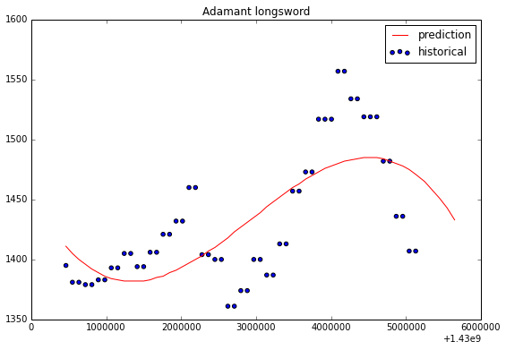

# Runescape-Grand-Exchange-Market-Data
Years of Runescape Grand Exchange data collected from grandexchangewatch.com. Cleaned, pruned for duplicates, and some analysis. 

Runescape has a terrible API. Just terrible. 

I spent at least 20 hours scraping the grandexchangewatch.com website for the data using BeautifulSoup and Requests. The cleaning was a nightmare, but in the end all was eventually handled.

The data is in the zip file which expands into a 300MB CSV file.

<table>
<tr><td><h2>Information on the dataset</h2></td></tr>
<tr><td>Oldest Record is ~3.6 years</td></tr>
<tr><td>Catalogs 2893 items</td></tr>
<tr><td>Features include high alch, low alch, dates, prices,
 price changes, categories, item names, and the members/non-members boolean</td></tr>
 </table>

Note: In the analysis notebook, there exists code for encoding the labels (e.g. the item name) as numeric values, but the data file is left 'as is' for your analysis. 

All of the 'analysis' is incredibly crude. This was more of a data-scraping-and-cleaning project than a predictive modeling one.

Here's a pretty picture!

The analysis pulls the data from my local MongoDB storage, so you should rewrite that to just pull from the CSV that you can get from the data (zip) file.

i.e. load a csv into pandas for your analysis. 

Enjoy.
